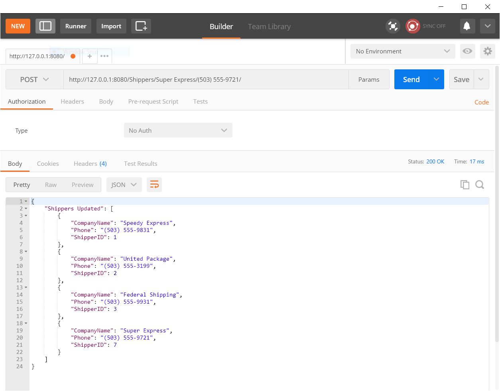

This demonstrates a base level way to produce a Restful API referencing a database (in this case the Northwind database hosted locally on SQL Server) using Flask in Python.  This shows the procedures for viewing, adding new records, editing existing records and deleting records.  The screen show below show the server being accessed with through the Postman application.  This is not exactly how a production Rest API would look like but hopefully gives a simple demonstration of how this can be put together using Flask. 

